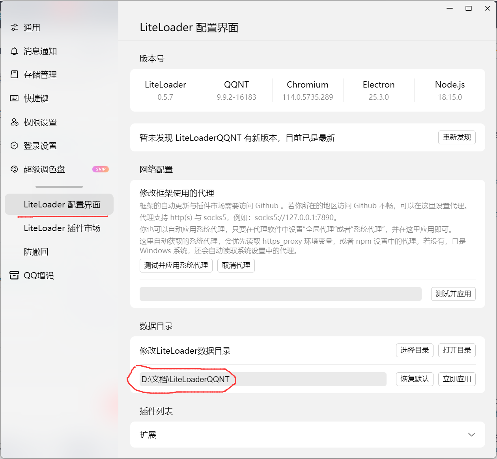

<div align="center">
<h1>使用教程</h1>
</div> 

1. 下载并安装[QQNT9.9.2.16183](https://cowtransfer.com/s/cf45f925cd1346)（**最高支持到这个版本，高版本使用不了！！！**）
2. 安装VC库（双击VC_redist.x64.exe安装并重启电脑）
3. 解压LiteLoaderQQNT.zip并将压缩包内的LiteLoader文件夹放到QQNT安装目录下的resources/app文件夹内
4. 将LiteLoaderQQNT-Launcher_x64.exe放到QQNT安装目录下（记得右键发送到桌面快捷方式）
5. 右键以管理员运行LiteLoaderQQNT-Launcher_x64.exe（启动失败的直接双击启动），登录机器人QQ
6. 解压LiteLoaderQQNT-Plugin-Chronocat-master.zip并将压缩包内的LiteLoaderQQNT-Plugin-Chronocat-master文件夹放到LiteLoader数据目录下的plugins文件夹内（NTQQ主页左下角三条横杠，点击后点设置，在LiteLoader配置界面可以看到，图中画圈部分就是，打开即可）并重启QQ

7. 将apps.js放到Miao-Yunzai根目录下
8. 克隆[ws-plugin](https://gitee.com/xiaoye12123/ws-plugin)插件的red分支
```
git clone -b red --depth=1 https://gitee.com/xiaoye12123/ws-plugin.git ./plugins/ws-plugin/
```
9. node apps启动一次或者复制一份Miao-Yunzai\plugins\ws-plugin\config\default_config文件夹并重命名为config
10. 打开Miao-Yunzai\plugins\ws-plugin\config\config\ws-config.yaml，在servers:后面添加如下配置
```
- name: QQNT
  address: 127.0.0.1:16530
  type: 4
  accessToken: 
  reconnectInterval: 10
  maxReconnectAttempts: 0
  uin: 
  closed: false
```

填好后的样子：

```
servers:
  - name: QQNT
    address: 127.0.0.1:16530
    type: 4
    accessToken: 
    reconnectInterval: 10
    maxReconnectAttempts: 0
    uin: 
    closed: false
```

 # 记得填入uin！！！ 不会加的直接复制并替换"填好后的样子"，将uin填入即可。格式一定不能错，不然会报错！！！

11. 在Miao-Yunzai根目录使用node apps启动即可

# 配置文件说明
```
  - name:  // 连接名字
    address:  // 连接地址（默认为127.0.0.1:16530）
    type: 4  // 连接类型，这里使用red连接
    accessToken: Token(为空尝试自动获取，获取失败的去C:\Users\用户名\.chronocat\config\chronocat.yml复制)
    reconnectInterval:  // 重连间隔: 断开连接时每隔多少秒进行重新连接，默认为5
    maxReconnectAttempts:  // 最大重连次数: 达到这个数之后不进行重连,为0时会不断重连，默认为0
    uin: // 机器人QQ
    closed: false
```

# 使用中会遇到的问题（介意勿用！！！）：

1. 部分插件或功能不支持，如：椰奶的赞我
2. 报错加载群员列表超时

# 注意：NTQQ不能关闭，否则使用不了！！！


